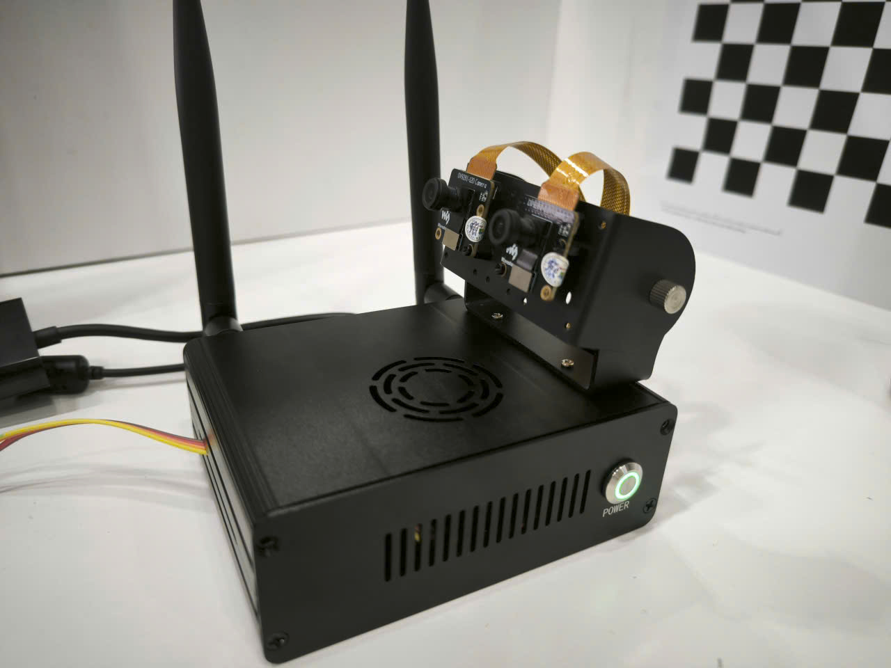

# OV9281 Dual-Camera Driver Port — Jetson Orin Nano (L4T R35.6.5 → R39.2)

Porting NVIDIA's original OV9281 sensor driver — written for kernel 5.10 /
L4T R35.6.5 and dropped from the BSP as of kernel 6.8 / L4T R39.2 — forward
to the current tegracam v2.0 framework, and bringing up two OV9281 global
shutter mono cameras simultaneously on a Jetson Orin Nano.



## TL;DR

- Two Waveshare OV9281-120 (OmniVision OV9281, 1MP, global shutter, mono,
  2-lane MIPI CSI-2) wired to CAM0/CAM1 on a Jetson Orin Nano Super Dev Kit.
- NVIDIA shipped an official `nv_ov9281.c` driver through L4T R35.x (kernel
  5.10), but **removed it from L4T R39.x (kernel 6.8)** — it is absent from
  the current Camera Support Matrix entirely.
- This project recovers the original driver from the R35.6.5 BSP sources,
  ports it across two simultaneous framework generations (legacy
  `v4l2_ctrl_ops` → tegracam v2.0, kernel 5.10 → 6.8 API), writes a new
  device tree overlay for dual-camera operation, and brings both sensors up
  to working raw frame capture.
- **Result: both cameras capture correct raw frames via V4L2, independently
  and simultaneously**, verified with real images (see `docs/`).
- Argus (`nvarguscamerasrc`) does **not** work for this sensor — root-caused
  to a hard architectural limitation in NVIDIA's closed-source Argus/SCF
  library (no monochrome pixel format support at all), not a driver bug.
  See [Known Limitations](#known-limitations).
- Includes a stereo depth-map demo built on the two synchronized mono feeds.

## Why this driver needed porting at all

NVIDIA's `Camera Driver Porting` documentation for R39.2 confirms a
`CONFIG_NV_VIDEO_OV9281=m` build option that existed under kernel 5.10 and
is marked `N/A` under kernel 6.8 — i.e. NVIDIA shipped this driver, then
dropped it when the kernel major version changed, without a public port.
The current R39.2 Camera Support Matrix does not list OV9281 among its
reference sensors at all.

## Hardware

| | |
|---|---|
| Board | NVIDIA Jetson Orin Nano Engineering Reference Developer Kit Super |
| L4T | R39.2 (JetPack 7.2), kernel 6.8.12-1021-tegra |
| Cameras | 2× Waveshare OV9281-120 (OmniVision OV9281, 1280×800, global shutter, mono, 2-lane MIPI CSI-2) |
| Baseline reference | IMX219 (Sony, Bayer, factory-supported) — used throughout as an architectural cross-check |

## Architecture

```
Userspace (v4l2-ctl / OpenCV)
        │
   /dev/video0, /dev/video1        ← V4L2 device nodes (tegra-capture-vi)
        │
┌───────┴──────────────────────────────────────┐
│  V4L2 Framework / tegracam v2.0 (kernel)       │
│                                                 │
│  ┌──────────────┐      ┌──────────────────┐   │
│  │ nv_ov9281.c   │      │ NVCSI / VI        │   │
│  │ (this port)   │──────▶│ (nvidia-oot,      │   │
│  │               │      │  unmodified)      │   │
│  └──────────────┘      └──────────────────┘   │
└─────────────────────────────────────────────────┘
        │                              │
     I2C (SCCB, via i2c-mux-gpio)   CSI-2 PHY (2-lane, per-camera)
        │                              │
┌───────▼────────┐            ┌────────▼────────┐
│  OV9281 (cam0)  │            │  OV9281 (cam1)  │
└─────────────────┘            └─────────────────┘
```

I2C is a single physical controller multiplexed via `i2c-mux-gpio`
(`cam_i2cmux`), not two independent buses — both sensors respond at the same
7-bit address (`0x60`) on separate mux channels, which is safe because the
mux driver serializes access at the kernel level.

## Porting summary

Ported from the original NVIDIA driver (`nv_ov9281.c`, R35.6.5, kernel
5.10, legacy v1 `v4l2_subdev_ops`/`v4l2_ctrl_ops` framework) to the current
tegracam v2.0 architecture used by `nv_ov5693.c`/`nv_imx219.c` in R39.2:

- Restructured `ov9281_s_stream()` into separate
  `start_streaming()`/`stop_streaming()` callbacks (framework-driven, not
  self-implemented `v4l2_subdev_video_ops`).
- Split the monolithic `ov9281_s_ctrl()` switch-case into individual
  `set_gain()`/`set_exposure()`/`set_frame_rate()`/`set_group_hold()`
  callbacks registered via `tegracam_ctrl_ops`, with correct
  `pixel_clock`/`line_length`/`*_factor` unit conversions per the tegracam
  v2.0 contract.
- Rewrote `power_on()`/`power_off()`/`power_get()`/`power_put()` against
  `s_data->power` (pointer, tegracam-managed) instead of a driver-private
  power rail struct.
- Removed the legacy `set_fmt()`/`get_fmt()`/`ctrls_init()`/
  `g_volatile_ctrl()` V4L2 v1 boilerplate entirely (framework now owns
  format negotiation and control initialization from `ctrl_cid_list[]`).
- Ported OTP/fuse-ID readout to the `fill_string_ctrl()` contract (the old
  driver looked up `v4l2_ctrl_find()` against a control handler field that
  no longer exists on the sensor struct in v2.0).
- Applied the full kernel 5.10 → 6.8 API checklist from NVIDIA's own
  `Camera Driver Porting` documentation (i2c probe/remove signature changes,
  V4L2 async struct changes, dma-buf kmap→vmap, etc).

A real bug was found and fixed in NVIDIA's original 2016-era mode table
(`ov9281_mode_tbls.h`): the 640×400 mode was assigned the same 60fps frame
rate table as the two higher-resolution modes, when the datasheet specifies
~210fps at that resolution. Cross-checked against the sensor's own PLL/HTS/
VTS register values (`pixel_clock = HTS × VTS × fps`), confirmed against
both the known-correct 60fps case and the datasheet's 210fps figure, and
fixed.

## The debugging journey

Getting from "compiles cleanly" to "captures a real image" took nine
separate, non-obvious failures. Each one is kept here because the process
of isolating and root-causing them is arguably more representative of
embedded systems work than the port itself.

| # | Symptom | Root cause | Fix |
|---|---|---|---|
| 1 | `probe failed with error -22` | `TEGRA_CAMERA_CID_GROUP_HOLD` declared in `ctrl_cid_list[]` — the framework already injects this CID automatically; declaring it again collided | Removed the duplicate CID declaration |
| 2 | `probe failed with error -121` (I2C EREMOTEIO) after chip ID verify succeeded | `ov9281_board_setup()` unconditionally fell through to a cleanup label that powered off the sensor and disabled its clock **even on the success path**, right before the framework's own control-handler setup tried to write registers | Added an explicit `return 0` on the success path, separate from the error label |
| 3 | Same `-121` persisted after fix #2 | Root-caused by re-deriving the theory from first principles: since IMX219 conditionally skips `camera_common_mclk_disable()` (no `mclk_name` in its DT), while OV9281's `.dtsi` *did* declare a clock (`extperiph1/2`) purely to satisfy a software requirement — that clock was never confirmed to physically drive the sensor | Removed `clocks`/`clock-names`/`mclk` from the `.dtsi` entirely and skipped `camera_common_parse_clocks()` in `parse_dt()`, matching IMX219's pattern (MCLK is a board-level fixed oscillator, not software-controlled) |
| 4 | `-121` persisted again, now only on register `0x3509` (gain low byte) of a 3-register write burst | The ported `set_gain()` had dropped register `0x3507` (`GAIN_SHIFT`) that the original 2016 driver wrote alongside `0x3508`/`0x3509` in a single burst table | Restored the 3-register burst write via `ov9281_write_table()`, matching the original driver exactly |
| 5 | Both sensors probed cleanly, but `dmesg` showed a GNOME session crash right after boot | Unrelated: a stray `gnome-session-binary` SIGSEGV, confirmed via `journalctl` to be pre-existing desktop/DBus noise, not camera-related | No action needed |
| 6 | `cam0` capture hung indefinitely with `request timed out after 2500 ms`; `cam1` captured a perfect 2,048,000-byte frame on the first try | I2C and CSI negotiation both looked identical between the two channels — physically swapping the two camera modules between CAM0/CAM1 slots proved the fault followed the **slot**, not either camera module | Isolated the difference to a missing `lane_polarity` property on the CAM0 `.dtsi` node — present on the IMX219 reference for the same physical slot, silently dropped when the OV9281 `.dtsi` was authored from that reference |
| 7 | Fixing #6 required rebuilding the `.dtbo`, which then also revealed the clock fix (#3) had never actually been installed to `/boot` in a prior session | Both fixes were bundled into one rebuild-and-reinstall cycle | — |
| 8 | `v4l2-ctl --list-formats-ext` reports `BG10` (10-bit Bayer) for a monochrome sensor | Traced the entire pixel-format path (`.dtsi` `pixel_t` → `sensor_common.c` → `camera_common.c` → `vi5_formats.h`) and confirmed there is genuinely no monochrome (`Y10`/`GREY`) entry anywhere in `nvidia-oot`'s format tables — only Bayer/RGB/YUV | Documented as a known limitation (raw byte data is correct regardless of the metadata label; only the V4L2 format *name* is wrong) rather than patched, since a real fix requires extending three shared framework files used by every sensor on the platform |
| 9 | `nvarguscamerasrc` fails immediately with `No cameras available` | `nvargus-daemon`'s log shows `SCF: Error 0x00000004: Unknown sensor pixel type` in `translateColorFormat()` — a closed-source Argus/SCF library function with no source available to patch | Confirmed as a hard architectural limit (see [Known Limitations](#known-limitations)); V4L2 direct capture used instead |

## Building

```bash
cd nvidia-oot/drivers/media/i2c
# nv_ov9281.c, ov9281_mode_tbls.h, ov9281.h and trace/events/ov9281.h are
# placed alongside the existing NVIDIA sensor drivers in this directory.
```

Built and linked against the platform's real `tegra-camera.ko` (not a
standalone/mocked build) using the top-level `Linux_for_Tegra/source/Makefile`
entry point with `kernel_name=noble system_type=l4t` — building
`nvidia-oot/Makefile` in isolation fails because it never generates
`nvidia/conftest.h`, the kernel-feature-detection header the whole tree
depends on.

```bash
# from Linux_for_Tegra/source
make -C /usr/src/linux-headers-<version>/3rdparty/canonical/linux-noble \
     M=$(pwd)/nvidia-oot kernel_name=noble system_type=l4t modules
```

## Device tree

Two new files, built as a boot overlay (not a base DTB rebuild) and loaded
via a dedicated `extlinux.conf` boot entry alongside — not replacing — the
existing IMX219 entry:

- `tegra234-camera-ov9281-dual.dtsi` — sensor nodes for both cameras.
- `tegra234-p3767-camera-p3768-ov9281-dual.dts` — board-level overlay
  wrapper (i2c-mux channel assignment, GPIO reset routing).

GPIO reset pins were cross-verified against the **live, running** device
tree (`/proc/device-tree`, not just the static source) for the IMX219
reference sensor sharing the same physical CSI connector, confirming
`TEGRA234_MAIN_GPIO(H,6)` / `TEGRA234_MAIN_GPIO(AC,0)` are properties of the
connector slot itself, not of whichever sensor is attached.

See [`ovti,ov9281.yaml`](ovti,ov9281.yaml) for the full binding
documentation, written to match upstream Linux kernel DT-binding
conventions.

## Verifying capture

```bash
v4l2-ctl -d /dev/video0 --list-formats-ext
v4l2-ctl --set-fmt-video=width=1280,height=800,pixelformat=BG10 \
  --stream-mmap --stream-count=1 -d /dev/video0 --stream-to=cam0.raw
```

Both cameras were verified capturing independently, simultaneously
(concurrent processes), and under sustained streaming load (30 consecutive
frames each, in parallel) with no I2C-mux contention or CSI dropouts.

## Known limitations

- **Argus / `nvarguscamerasrc` does not work with this sensor.** NVIDIA's
  closed-source Argus camera service (SCF) has no monochrome pixel-format
  path at all — `translateColorFormat()` fails outright before any ISP
  processing is attempted. This matches NVIDIA's own documentation, which
  states that Bayer-sensor ISP tuning is only available for the reference
  OV5693 sensor and otherwise requires working with an NVIDIA-certified
  camera partner, outside the public BSP release. **V4L2 direct capture
  (`v4l2-ctl`, or any V4L2-based application/library) is the correct and
  fully supported path for this sensor** and is what the stereo demo below
  uses.
- The V4L2 pixel format is labeled `BG10` (10-bit Bayer) rather than a
  correct monochrome format, because `nvidia-oot`'s shared format-mapping
  tables (used by every sensor driver on the platform) have no
  monochrome entry. The underlying raw byte data is unaffected and
  correct — only the format *name* is wrong. Fixing this properly requires
  extending three files shared across all sensor drivers
  (`sensor_common.c`, `camera_common.c`, `vi5_formats.h`), which was
  deliberately deferred to avoid risking regressions on the working IMX219
  camera path.

## Stereo depth demo

See [`demo/stereo_depth.py`](demo/stereo_depth.py). Captures a synchronized
frame pair from both cameras via V4L2, computes a disparity map with
OpenCV's block-matching stereo algorithm, and saves a colorized depth
visualization. See the script's header comment for calibration notes —
without a proper stereo calibration (baseline distance, focal length in
pixels), the output is a qualitative disparity map, not calibrated metric
depth.

## Sources

- Original `nv_ov9281.c` / `ov9281_mode_tbls.h`: NVIDIA Jetson Linux R35.6.5
  BSP sources (`Driver Package (BSP) Sources`), kernel 5.10.
- Porting target/reference: NVIDIA Jetson Linux R39.2 (JetPack 7.2) BSP
  sources, `nvidia-oot/drivers/media/i2c/nv_ov5693.c` and `nv_imx219.c`.
- OV9281 datasheet: OmniVision, Preliminary Specification v1.22.
- NVIDIA `Camera Driver Porting` and `Camera Software Development Solution`
  documentation, Jetson Linux Developer Guide, R39.2.
